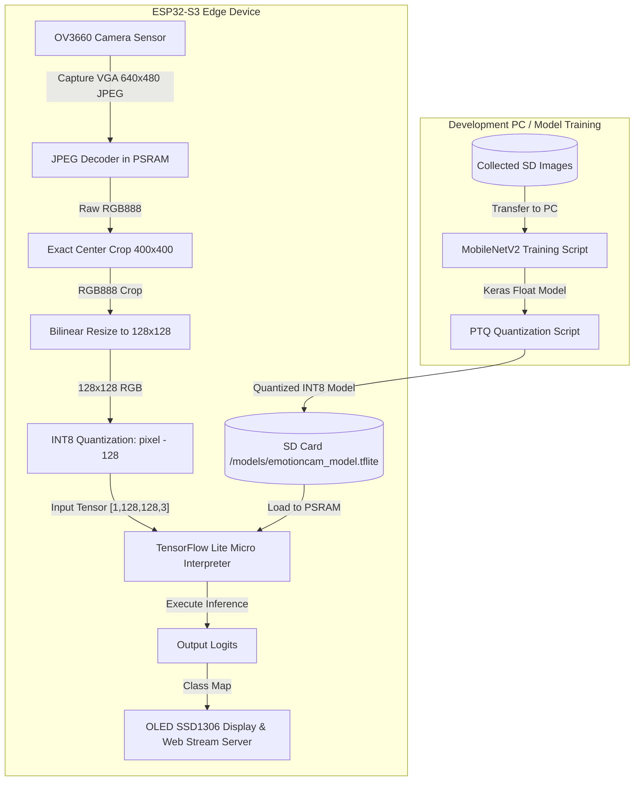

# 📸 ALQAI EmotionCam — ESP32-S3 TinyML Edge AI Camera

[](https://www.espressif.com/)
[](https://www.tensorflow.org/lite/micro)
[](https://platformio.org/)
[](https://github.com/)

An end-to-end, edge-AI computer vision system built around the **ESP32-S3** microcontroller. The **ALQAI EmotionCam** project implements real-time, on-device facial emotion recognition (classifying **neutral**, **happy**, **sad**, and **surprise**) directly from camera feeds using **TensorFlow Lite Micro (TFLM)**. 

The project spans the entire TinyML development lifecycle:
1. **Phase 1**: Low-level hardware diagnostic bring-up and verification.
2. **Phase 2**: Wireless dataset collection portal and model training/quantization framework.
3. **Phase 3**: On-device image preprocessing and real-time edge AI inference pipeline.

---

## 🛠️ System Architecture



---

## 🔌 Hardware Configuration

The system is configured specifically for the **4D Systems ESP32-S3 Gen4** board (featuring **16 MB Flash** and **8 MB Octal PSRAM** in `qio_opi` mode).

### Pin Mappings

| Component | Signal | GPIO Pin | Description |
| :--- | :--- | :--- | :--- |
| **OLED Display (SSD1306)** | I2C SDA | `GPIO 42` | Hardware I2C for SSD1306 |
| | I2C SCL | `GPIO 41` | Speed: 400 kHz, Address: `0x3C` |
| **MicroSD Card Reader** | SD_MMC CMD | `GPIO 38` | Configured in high-speed 1-bit mode |
| | SD_MMC CLK | `GPIO 39` | |
| | SD_MMC D0 | `GPIO 40` | Mount point: `/sdcard` |
| **OV3660 Camera** | D0 - D7 | `11, 9, 8, 10, 12, 18, 17, 16` | 8-bit parallel data interface |
| | XCLK / PCLK | `15` / `13` | System Clock (20 MHz) / Pixel Clock |
| | VSYNC / HREF | `6` / `7` | Frame and Line synchronization |
| | SIOD / SIOC | `4` / `5` | SCCB configuration interface |
| | PWDN / RESET | `-1` / `-1` | Managed internally/tied |

> [!NOTE]
> All peripherals share the ESP32-S3's high-speed **PSRAM (SPIRAM)** to accommodate large frame buffers, decoded RGB images, and TensorFlow Lite Micro's tensor arena without exhausting internal SRAM.

---

## 📂 Project Structure

```text
esp32s3-tinyml-emotion-cam/
├── README.md               # Main project documentation
├── phaseOne/               # Hardware Diagnostics & Peripheral Testing
│   ├── src/main.cpp        # Low-level bring-up code
│   └── platformio.ini      # Phase 1 project configuration
├── phaseTwo/               # Data Ingestion & Model Development
│   ├── code/               # Python training, cleanup, and quantization scripts
│   │   ├── dataset/        # Raw captured dataset folders
│   │   ├── train_pretrained.py     # MobileNetV2 V2 trainer
│   │   ├── convert_compare_ptq_v3.py  # PTQ comparison & evaluator
│   │   ├── config.py       # Shared training parameters
│   │   └── requirements.txt
│   ├── src/                # Dataset collection firmware (Modular)
│   └── platformio.ini      # Phase 2 project configuration
└── phaseThree/             # Real-Time On-Device Inference
    ├── include/            # TinyML application headers (AiConfig.h, ModelOps.h)
    ├── src/                # TFLM inference pipeline source code
    ├── tools/              # Helper script to parse models and generate operator resolvers
    ├── partitions.csv      # Custom flash memory partitioning schema
    ├── platformio.ini      # Phase 3 configuration (dual espidf/arduino framework)
    └── sdkconfig.4d...     # Tailored ESP-IDF menuconfig parameters
```

---

## 🚀 The Three Phases of Development

### Phase 1: Hardware Diagnostics & Peripheral Verification
Low-level diagnostic firmware to test physical electrical connections and confirm the proper initialization of I2C, SPI/MMC, and parallel camera registers.
* **Flow**: 
  1. Boot-up checks and updates status output on the SSD1306 OLED screen.
  2. Mounts the MicroSD card in 1-bit SD_MMC mode.
  3. Initializes the OV3660 camera and captures 3 test VGA frames.
  4. Saves test JPEGs to `/captures/phase6_0X.jpg` on the SD card.
  5. Performs raw file verification by checking for valid JPEG SOI (`0xFFD8`) and EOI (`0xFFD9`) markers.
  6. Displays a "Ready Face" animation on the OLED when all tests pass.

### Phase 2: Wireless Dataset Collection & Model Training
Modular data ingestion firmware and model quantization pipeline.
* **Ingestion Web Portal**: Starts a Wi-Fi Access Point (`ALQAI-EmotionCam`) and hosts a local web application at `http://192.168.4.1`. Users can stream the live camera feed and capture images directly to corresponding emotion folders (`/neutral`, `/happy`, `/sad`, `/surprise`) on the SD card.
* **Dataset Verification**: Python scripts scan collected images, verify JPEG integrity, and repair corrupt files.
* **Model Training**: A custom convolutional neural network utilizing a pre-trained **MobileNetV2 base (Alpha=0.50)** with custom Dense classification layers is fine-tuned to classify 4 emotions.
* **Post-Training Quantization (PTQ)**: Compares multiple quantization types (INT8 Softmax, INT8 Logits, UINT8 Logits) using representative data calibration to select the best option.
  ```powershell
  # Quantize and compare
  python convert_compare_ptq_v3.py
  ```

### Phase 3: On-Device TinyML Inference
The final deployment phase runs local real-time edge AI inference using TensorFlow Lite Micro.
* **TFLite Model Loader**: Loads the selected quantized model (`/models/emotioncam_model.tflite`) from the SD card directly into PSRAM.
* **Real-time Pipeline**:
  1. **Capture**: Grabs a camera frame from the OV3660.
  2. **JPEG Decode**: Decodes the JPEG frame into a raw RGB888 buffer in PSRAM.
  3. **Crop**: Extracts an exact **400x400 center crop** (focusing on the face).
  4. **Resize**: Resizes the cropped image to **128x128** using bilinear interpolation.
  5. **Quantize**: Maps floating-point pixel values to INT8 (`pixel - 128`).
  6. **Inference**: Invokes TFLite Micro to execute model inference.
  7. **Display**: Outputs the predicted emotion and execution times on the OLED screen and web interface.

---

## 🛠️ Step-by-Step Execution Guide

### 1. Build and Flash Diagnostic Firmware (Phase 1)
Connect the board to your computer via its native USB CDC port.
```bash
cd phaseOne
pio run --target upload
pio device monitor
```
Ensure that OLED, SD card, and Camera diagnostics output `PASS` in the serial monitor.

### 2. Run Dataset Collection & Train the Model (Phase 2)
Build and flash the dataset firmware:
```bash
cd ../phaseTwo
pio run --target upload
```
1. Connect to the Wi-Fi AP: `ALQAI-EmotionCam`.
2. Navigate to `http://192.168.4.1` on your device.
3. Stream video and click the capture buttons to record images for each emotion class.
4. Insert the SD card into your computer, copy the images to `phaseTwo/code/dataset/`, and run training:
   ```bash
   cd code
   pip install -r requirements.txt
   python repair_dataset_jpegs.py
   python train_pretrained.py
   python convert_compare_ptq_v3.py
   ```
5. Copy the generated `outputs/emotioncam_ptq_v3_int8_logits.tflite` to your SD card under `/models/emotioncam_model.tflite`.

### 3. Deploy On-Device Edge AI Inference (Phase 3)
Generate a clean, minimal TensorFlow operator resolver based on your model:
```bash
cd ../../phaseThree
python tools/generate_model_ops.py ../phaseTwo/code/outputs/emotioncam_ptq_v3_int8_logits.tflite include/ModelOps.h
```
This generates `include/ModelOps.h` with the exact ops used by the model, minimizing flash usage.

Now, compile and flash the inference firmware:
```bash
pio run --target upload
pio device monitor
```
Open `http://192.168.4.1` to view real-time predictions and camera feeds, or read the local predictions directly from the onboard OLED display!

---

## 💡 Key Design Decisions & Optimizations

* **Dual Arduino + ESP-IDF Framework**: Arduino's ease of use is combined with ESP-IDF's low-level performance capabilities, enabling custom partitions, menuconfig overlays, and optimal PSRAM configuration.
* **TFLM Operator Optimization**: Instead of compiling all TensorFlow operators (which bloats binary sizes and exceeds flash limits), the `generate_model_ops.py` script ensures that only the exact operators used by the model are registered.
* **On-Device Image Processing**: Hardware-accelerated camera frames are preprocessed in PSRAM. Center crop (400x400), bilinear interpolation resizing, and integer mapping are performed with memory-aligned structures to achieve efficient execution times.
* **Stability Fixes**: Resolved critical issues such as FreeRTOS clock frequency mismatches (`CONFIG_FREERTOS_HZ=1000`) and entrypoint configurations (`CONFIG_AUTOSTART_ARDUINO=y`) to guarantee a stable 24/7 edge device runtime.

---

## 📄 License & Credits
Developed by **ALQAI System** for ESP32-S3 TinyML implementations. Open-source under the MIT License.
